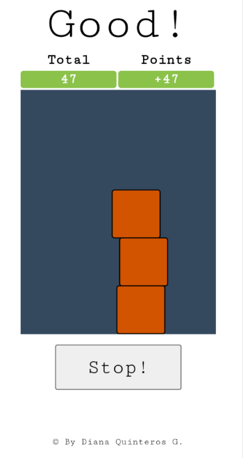

# PureJSGame
I created this 2D game while I was learning DOM manipulation using pure JavaScript.

Just pile the boxes without missing anyone 
and have fun doing it!

<a href="https://dianaquinteros.github.io/PureJSGame/" target="_blank" style="display:block;margin:0 auto;">Play!</a>

